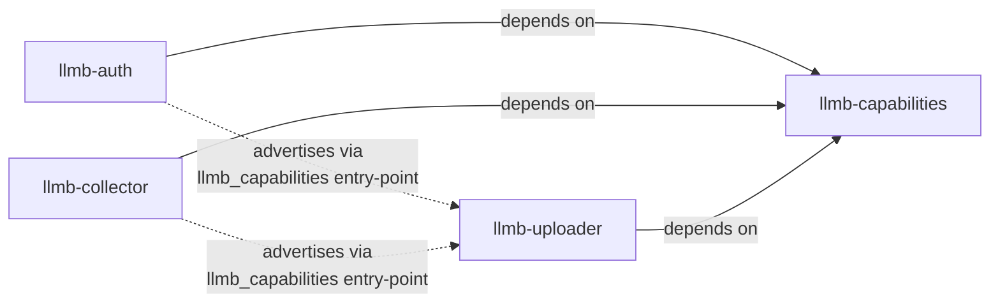

# llmb-capabilities

Cross-package contract for the LLMB capability registry. Defines the
`llmb_capabilities` entry-point group, the canonical capability name
constants, the `Capability` dataclass, per-capability `Protocol`s, and
conformance helpers.

This package contains **no runtime logic and no advertised capabilities**
of its own. Providers (e.g. `llmb-auth`, `llmb-collector`) and consumers
(e.g. `llmb-uploader`) install it as a tiny shared dependency so they
agree on the contract without depending on each other.

## Why this package exists

Three otherwise independent packages need to agree on:

- The entry-point group name (`llmb_capabilities`).
- The set of capability names (`oauth.bearer-token`, `oidc.id-token`,
  `tls.ssl-context`, `system.collect`, `system.commands-config`,
  `storage.upload`, `post-processor.process`).
- The shape of the `Capability` advertisement object.
- The `invoke` signature for each capability.
- The per-capability `version: int` ceiling each consumer supports.

Without this package, those agreements live as duplicated string
literals and copy-pasted dataclasses. With it, the agreement is a
versioned import.



`llmb-auth` and `llmb-collector` never depend on each other or on
`llmb-uploader`. `llmb-uploader` never depends on a specific provider.
The only shared knowledge is this package.

## Install

```bash
uv pip install llmb-capabilities
```

The package has zero runtime dependencies (stdlib only) and is safe to
add to the install closure of any LLMB tool.

## Usage

### As a provider (e.g. `llmb-auth`, `llmb-collector`)

```python
from llmb_capabilities import BEARER_TOKEN, Capability

def _invoke_bearer_token(namespace, *, prefix=None, method="ssa", force=False):
    ...

CAPABILITIES = (
    Capability(
        name=BEARER_TOKEN,
        version=1,
        invoke=_invoke_bearer_token,
        metadata={"provider": "llmb-auth"},
    ),
)
```

Advertise via `pyproject.toml`:

```toml
[project.entry-points."llmb_capabilities"]
default = "llmb_auth.capabilities:CAPABILITIES"
```

### As a consumer (e.g. `llmb-uploader`)

```python
from importlib.metadata import entry_points
from llmb_capabilities import (
    BEARER_TOKEN,
    BearerTokenCapability,
    CAPABILITY_GROUP,
    SUPPORTED,
)

for ep in entry_points(group=CAPABILITY_GROUP):
    for cap in ep.load():
        if cap.name == BEARER_TOKEN and isinstance(cap, BearerTokenCapability):
            if cap.version <= SUPPORTED[BEARER_TOKEN]:
                token = cap.invoke(namespace, prefix=None, method="ssa")
```

Use `discover_providers()` when a consumer needs the complete installed
registry before applying its own capability/version/provider policy:

```python
from llmb_capabilities import discover_providers

for provider, capabilities in discover_providers().items():
    print(provider, sorted(capabilities))
```

### Model-first capabilities (e.g. `llmb-uploader`)

`storage.upload` and `post-processor.process` are **model-first**:
`invoke` takes an already-built model instance (`args_model`) rather
than an `argparse.Namespace`. A storage upload's CLI surface
(destination, credentials, compression, metadata, ...) is large and
structured enough that re-deriving it inside every provider's `invoke`
would duplicate the boundary logic once instead of centralizing it.

Provider side — set `args_model` on the advertisement:

```python
from llmb_capabilities import STORAGE_UPLOAD, Capability
from my_uploader.cli_args import MyUploaderCliArgs

def _invoke_storage_upload(cli_args: MyUploaderCliArgs, /):
    ...

CAPABILITIES = (
    Capability(
        name=STORAGE_UPLOAD,
        version=1,
        invoke=_invoke_storage_upload,
        metadata={"provider": "my-uploader"},
        args_model=MyUploaderCliArgs,
    ),
)
```

Consumer side — build the model once via `resolve_capability_args`,
then call `invoke` through `invoke_sync` / `invoke_async` so callers
don't need to know whether a given provider implemented `invoke` as a
plain function or as `async def`:

```python
from llmb_capabilities import resolve_capability_args, invoke_sync

cli_args = resolve_capability_args(cap, namespace, prefix=None)
result = invoke_sync(cap, cli_args)
```

`invoke_async` is the same call from inside a running event loop; it
awaits a coroutine `invoke` directly and offloads a plain-function
`invoke` to a worker thread via `asyncio.to_thread` so it can't block
the loop.

### Conformance test (provider side)

Drop a single test in your provider's suite and you get continuous
verification that your `CAPABILITIES` tuple still satisfies the
contract:

```python
from llmb_capabilities.conformance import assert_capability_conforms
from llmb_auth.capabilities import CAPABILITIES

def test_capabilities_conform():
    for cap in CAPABILITIES:
        assert_capability_conforms(cap)
```

## Versioning policy

The contract is evolved **additively** between major bumps so that
breaking-shape changes in one capability never force unrelated
providers or consumers to release in lockstep.

| Change                                                        | Bump  |
| ------------------------------------------------------------- | ----- |
| Doc / typo fix                                                | patch |
| Add a new capability constant                                 | minor |
| Add a new `Protocol` class                                    | minor |
| Add an optional kwarg to a documented `invoke` signature      | minor |
| Bump `SUPPORTED[name]` and add `XxxCapabilityV2` alongside V1 | minor |
| Remove a constant or `Protocol` (after a deprecation period)  | major |
| Change the `Capability` dataclass shape                       | major |

Consumers and providers should pin `llmb-capabilities>=0.1,<1` while
the package is pre-1.0. After the first stable release, switch guidance
to `>=1,<2`. Major bumps are rare events that genuinely warrant a
coordinated re-pin.

The fine-grained drift knob is the per-capability `version: int` field
on `Capability`. Bump it when a single capability's `invoke` signature
changes non-additively; consumers compare against
`llmb_capabilities.SUPPORTED` and skip versions they don't understand.

## Package layout

```text
src/llmb_capabilities/
    __init__.py                    # public re-exports
    _constants.py                  # CAPABILITY_GROUP, names, SUPPORTED
    _capability.py                 # Capability dataclass + CapabilityLike / ModelValidatable Protocols
    _discovery.py                  # installed provider entry-point discovery
    _bearer_token.py               # BearerTokenCapability Protocol
    _oidc_id_token.py              # OidcIdTokenCapability Protocol
    _tls_ssl_context.py            # TlsSslContextCapability Protocol
    _system_collect.py             # SystemCollectCapability Protocol
    _system_commands_config.py     # SystemCommandsConfigCapability Protocol
    _storage_upload.py             # StorageUploadCapability Protocol (model-first)
    _post_processor_process.py     # PostProcessorProcessCapability Protocol (model-first)
    _resolve_args.py               # resolve_capability_args helper
    _invoke.py                     # invoke_sync / invoke_async helpers
    conformance.py                 # assert_capability_conforms helper
    py.typed                       # PEP 561 marker
```

## License

Apache-2.0. See [LICENSE](LICENSE).
